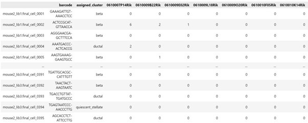

# batch-corrected scetm
This project is the final project of ZJUI ECE449 course. It's a batch effect corrected scETM model dealing with single cell annotation assignment. Only for academic use and please don't copy! Any action violates academic integrity is strictly forbidden and will be punished accordingly.

>* Other Group Member
>* Dataset
>* Program Usage
>* Batch Effect & Batch Correction Models
>* Method
>* Experiment & Results
>* Discussion
>* Reference

## Other Group Members' Information
Kong Zitai      - ZJUI Institute

Yao Wentao - ZJUI Institute

Liu Chang  - ZJUI Institute

## Dataset
We use 4 batches of Human’s data, each with 8569 cells by 20125 gene/cell and 2 batches of mouse’s data, each with 1886 cells by 14878 gene/cell. The Human pancreatic islet dataset come from the GEO or EMBL-EBI database under the accession codes GSE81076, GSE85241, GSE86469, E-MTAB-5061, and GSE84133. Mice’s comes from the GEO database under the accession code GSE84133.
In the dataset, each row represents all gene expression of a cell, each column represents all cell’s gene expression of a certain gene. There are also barcode showing the origin of the cell and cell label showing ground truth cell type.

To download the dataset we use, view the following link:

<https://zjuintl-my.sharepoint.com/:f:/g/personal/zitai_19_intl_zju_edu_cn/EuOqRKUn_PFEiWY4hn9NIGYBgODxu6iNuQsGoF_Tybz2cg?e=WoQ6gH>

## Program Usage
We have writen it in a jupyter notebook file, what you have to do is to download the dataset and all the files, put the dataset files in the same hierachy with the other files. Then you can run the human.ipynb or mouse.ipynb.

## Batch Effect & Batch Correction Models
### Batch effect
Batch effect is the error caused by different batches in experiments, normally caused by different person, devices or reagents applying on the same experiment. This may cause the data from the same source to diverge.

Since scETM model only considers a single categorical batch variable by adding a batch correction matrix λ, more effective ways to correct batch effects needed to be involved.

### Batch Correction Models
Through our research, we find that the batch effect is a big challenge and problem in the RNA-seq task. Therefore, we do some research on this field. And there are some papers that are of our references. Firstly, in the paper from (Laleh et al, 2018), it presents the basic mutual nearest neighbor method. As shown in the figure below.

From each sample in a batch, we search every nearest neighbor from other batches. If one of its neighbors also has a nearest neighbor of it, they become a mutual nearest pair. The goal of it is to minimize the distance among the nearest neighbor pair. This method can apply well in the task of RNA-seq. And in the paper (Li et al, 2020), the author presents an autoencoder based method. In the article, the author mentions that the autoencoder do well in extracting the feature of Gene expressions. It uses the latent feature extracted from the encoder to do the clustering and get the classification. In the paper (Shaham U et al, 2018), the author use the residual network with the Maximum Mean Discrepancy (MMD) loss to generate the data with removing the batch effect. And in the paper (Zou et al, 2021), the author combines the mutual nearest neighbors and the residual network together. In that case, the network can generate the data that is with similar expression with the original data and at the same time.

## Method
### Model Overview
Based on our research, we find that one outstanding challenge in the RNA-seq task is the batch effect issues, which is caused by different experimental conditions and different batch of samples. Therefore, we proposed our model based on scETM model. Inspired by the combination between MNN method and residual network, we proposed our batch – corrected scETM model. The framework of our model is shown in the figure below. As shown here, it is a two staged model. The scETM model used in our model is nearly the same as the original work. The only difference is that we remove the original batch correction strategy. In replacement of it, we propose our batch correction network. The Gene matrix data will be processed by this framework to remove the batch effect. After that, the processed data will be feed into the scETM model to start the training or inference process. Our batch correction network has four different steps: data preprocessing, dimension reduction, searching MNN pairs and training network with reconstruction and batch loss. The input gene matrix will firstly receive data preprocessing. Then, the latent feature of gene matrix will be extracted by a pretrained encoder. And then, the algorithm can be applied to these latent features to find MNN pairs. And our network will be trained on our batch correction network. In the inference stage, the data feed into our network will generate the batch corrected data through residual network.

### Data Preprocessing 
In this part, steps in preprocessing are nearly the same as the DeepMNN model. 
1. The data will be filtered by the users’ defined criteria. 
2. The cell expressions will be normalized with the total expressions. And then the data will be log-transformed. 
3. Then, since the gene matrix is in very high dimension, and many genes are not significant in our task with very fewer expression. Therefore, we extract the 2000 highest expressed genes. After that, the gene expression data is still in very high dimension. Therefore, we need to further reduce the dimension of the data.

### Dimension Reduction Through Pre-trained Encoder
Here, we have a pre-trianed encoder in my framework. If all the data are in the same gene subspace, they will share the same encoder in our model. This encoder is used to extract the latent gene feature used for searching MNN pairs. And in the training stage, we use these two encoders to extract the latent feature of our gene expression data and minimize the distance of a MNN pair through the batch loss.

### Searching MNN Pairs 
The search of MNN pairs is based on the latent features extracted from our pre-trained encoder. For each cell, we will search 20 nearest neighbors in other batches. And if any cell in the nearest neighbors also has a neighbor of that cell. In that case, they become a mutual nearest neighbor pair. After that process, we have the set of all MNN pairs. And all these data will make up to our training batches. The model will train on these data to minimize the distance of MNN pair and reconstruct the gene expressions data.

### Loss Function 
In our framework, we have two different losses. Reconstruction loss and batch loss. The batch loss is used to reduce the distance within a MNN pair. It is the Euclidean distance in the feature subspace in a batch of training data, as shown in the expression below. Here, for a training batch b, and the MNN pair k, we calculate the distance between this pair, and finally add all these distance together, as shown in the following expression:

Also, we have another loss function, it is the reconstruction loss. The preprocessed data will be feed into the residual network. Since the residual network has the residual term and identity term. So, it is easy for this network to learn the identity function of the input value. The structure of the residual network is shown in the figure below:

In that case, this network will serve as a calibration for our generated data. The reconstruction loss is also the distance between the generated data and the original data, as shown in the expression below: 

So, here we have the final loss function, which is the linear combination of the batch loss and reconstruction loss. As shown in the expression below: 

## Experiment & Results
### Results on Human's Data
The result of our batch effect correction on human cells is shown below. 
* Our Image

* Image of scETM

In each figure, the graph on the left shows the result of our classification, the one in the middle shows the distribution of data samples from all batches in different colors and the one on the right is the manually labelled ground truth. The original model can not eliminate the batch effect very well as the dots are distributed unevenly. In some area, the density of green dots are obviously higher than other colors. On the contrast, after our method is applied, the dots of different colors mixed together more evenly. It's also worth noting that the reason why the shape of distributions are different is that the data were normalized during pre-processing.

* Our Results

* Results of scETM

(Higher the data, better the performance)

### Results on Mice's Data
The result of our batch effect correction on mouse cells is shown below. 
* Our Image

* Image of scETM

The effect of batch effect correction is still obvious on the second data set of mice cells. The group of yellow and blue cells mixed together more evenly after applying our method. 
* Our Results

* Results of scETM

Moreover, we got better clustering results on this dataset, with almost all ARI values higher than the origi5nal model. A preliminary guess is that as there are only two batches of data in this data set, the task of batch effect correction is simpler, and our model performed better in this case.

## Discussion
By applying our modified deep MNN model for data preprocessing, we get quite good results on removing batch effects and get somehow better performance on certain indicators. For our future work, we can firstly apply our methods on more datasets to verify its performance, we can also further improve the batch effect correction network, improving its efficiency, and we will also explore the scETM model, improving its interpretability.

## Reference
[1] Haghverdi, L., Lun, A., Morgan, M. et al. Batch effects in single-cell RNA-sequencing data are corrected by matching mutual nearest neighbors. Nat Biotechnol 36, 421–427 (2018). <https://doi.org/10.1038/nbt.4091>

[2] Li, X., Wang, K., Lyu, Y. et al. Deep learning enables accurate clustering with batch effect removal in single-cell RNA-seq analysis. Nat Commun 11, 2338 (2020). <https://doi.org/10.1038/s41467-020-15851-3>

[3] Zou Bin, Zhang Tongda, Zhou Ruilong, Jiang Xiaosen, Yang Huanming, Jin Xin, Bai Yong deepMNN: Deep Learning-Based Single-Cell RNA Sequencing Data Batch Correction Using Mutual Nearest Neighbors  10.3389/fgene.2021.708981

[4] Shaham U, Stanton KP, Zhao J, Li H, Raddassi K, Montgomery R, Kluger Y. Removal of batch effects using distribution-matching residual networks. Bioinformatics. 2017 Aug 15;33(16):2539-2546. doi: 10.1093/bioinformatics/btx196. PMID: 28419223; PMCID: PMC5870543. 

[5] Zhao, Y., Cai, H., Zhang, Z. et al. Learning interpretable cellular and gene signature embeddings from single-cell transcriptomic data. Nat Commun 12, 5261 (2021). <https://doi.org/10.1038/s41467-021-25534-2>

[6] Mario Flores et al. Deep learning tackles single-cell analysis – A survey of deep learning for scRNA-seq analysis. <https://arxiv.org/abs/2109.12404>